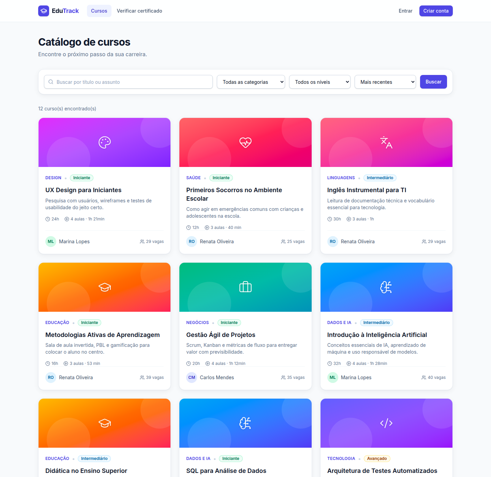
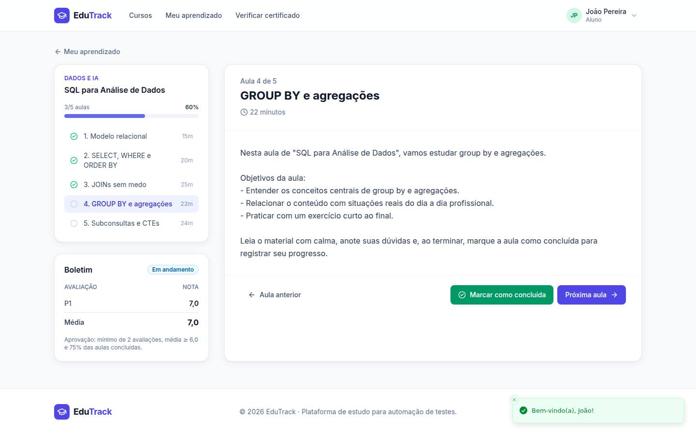
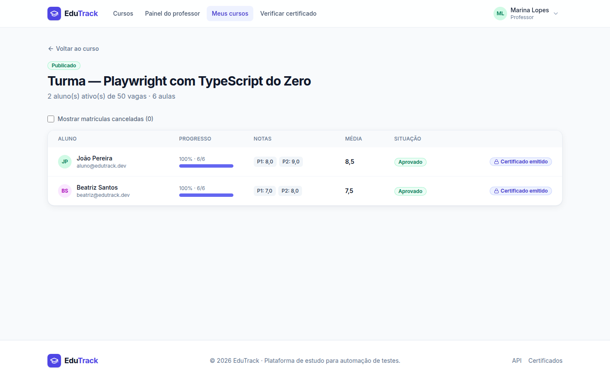
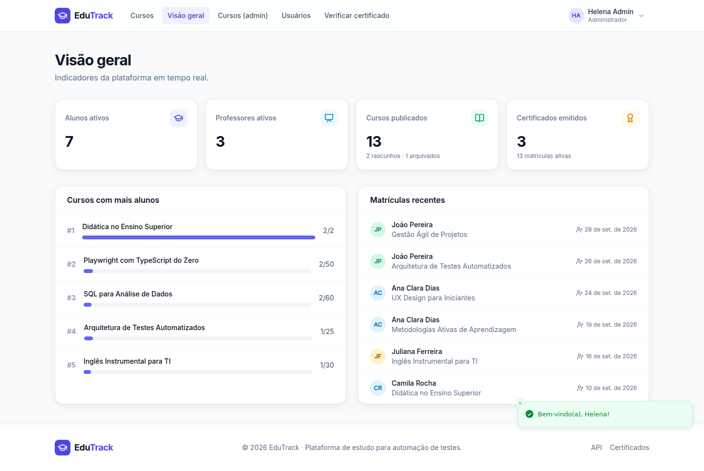
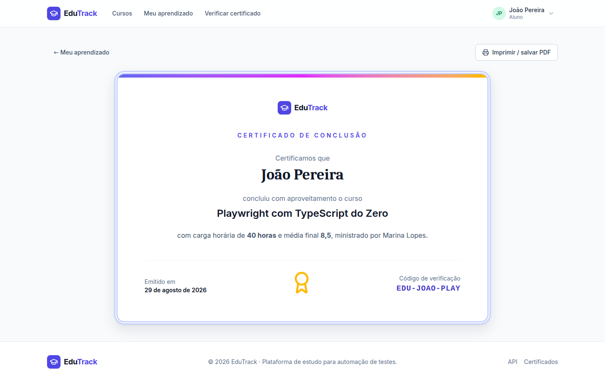

# 🎓 EduTrack

[](https://github.com/QAGarcia/edutrack/actions/workflows/ci.yml)

Plataforma de cursos online com **catálogo, matrículas, aulas com progresso, notas, situação acadêmica e certificados verificáveis**, com três perfis: aluno, professor e administrador.

> O EduTrack é o **sistema-alvo (SUT)** dos meus projetos de automação de testes. Foi construído como um produto real, com regras de negócio documentadas, erros padronizados e massa de dados determinística, para permitir testes de API, E2E e CI/CD com qualidade de mercado.



## Stack

| Camada | Tecnologias |
|---|---|
| API | NestJS 11 · TypeScript · TypeORM · PostgreSQL · JWT · class-validator · Swagger/OpenAPI |
| Web | React 19 · Vite · Tailwind CSS 4 · React Router 7 · TanStack Query · React Hook Form + Zod |
| Infra | npm workspaces (monorepo) · Docker · GitHub Actions · migrations versionadas |

## Funcionalidades

- **Visitante:** landing page, catálogo com busca sem acento, filtros, ordenação e paginação na URL, detalhe do curso e verificação pública de certificado.
- **Aluno:** cadastro, matrícula (com controle de vagas à prova de concorrência), player de aulas com progresso, boletim, cancelamento e emissão de certificado.
- **Professor:** painel com indicadores; criação e edição de cursos; gestão de aulas (criar, editar, reordenar, excluir); publicação e arquivamento; turma com lançamento e correção de notas.
- **Admin:** visão geral da plataforma, gestão de usuários (ativar e desativar com efeito imediato) e todos os cursos.

<table>
<tr><td></td><td></td></tr>
<tr><td></td><td></td></tr>
</table>

## Como rodar

Pré-requisitos: **Node.js 20+** e **PostgreSQL 14+** (local, Docker ou Supabase).

### 1. Banco de dados (escolha um)

**Postgres local (Linux/WSL):**

```bash
sudo apt install -y postgresql
sudo service postgresql start
sudo -u postgres psql -c "CREATE USER edutrack WITH PASSWORD 'edutrack';" -c "CREATE DATABASE edutrack OWNER edutrack;"
```

**Docker:** `docker compose up -d db`

**Supabase:** crie um projeto, copie a connection string do tipo **Session pooler** e, no `.env`, preencha `DATABASE_URL` e use `DATABASE_SSL=true`.

### 2. Aplicação

```bash
cp .env.example .env
npm install
npm run db:reset     # cria as tabelas (migrations) e a massa de dados
npm run dev          # API + frontend com recarregamento automático
```

| O quê | Endereço |
|---|---|
| Aplicação (dev) | http://localhost:5173 |
| API | http://localhost:3000/api |
| Swagger (UI) | http://localhost:3000/docs |
| OpenAPI (JSON / YAML) | http://localhost:3000/docs/json · http://localhost:3000/docs/yaml |

**Modo produção** (um único servidor, como no CI): `npm run build && npm start`, depois acesse http://localhost:3000.

### Tudo no Docker

```bash
docker compose up -d --build
docker compose exec app node apps/api/dist/database/cli/seed.js
```

## Usuários de demonstração

Senha de todos: **`Senha@123`**

| Perfil | E-mail |
|---|---|
| Aluno | aluno@edutrack.dev |
| Professor | marina.prof@edutrack.dev |
| Admin | admin@edutrack.dev |
| Conta desativada | pedro@edutrack.dev |

A lista completa, com os cenários preparados para teste, está em [docs/massa-de-dados.md](docs/massa-de-dados.md).

## Scripts

| Comando | O que faz |
|---|---|
| `npm run dev` | API (3000) + web (5173) em modo desenvolvimento |
| `npm run build` | Compila web e API |
| `npm start` | Sobe a API servindo o frontend compilado |
| `npm run db:migrate` | Aplica migrations pendentes |
| `npm run db:seed` | Recria a massa de dados (mantém o schema) |
| `npm run db:reset` | Apaga tudo, reaplica migrations e seed |
| `npm run lint` / `npm run typecheck` | Qualidade estática |

## Apoio à automação de testes

- `POST /api/testing/reset` limpa o banco e recria a massa em cerca de 1 s. A rota só existe com `ENABLE_TEST_ROUTES=true`.
- Erros sempre no formato `{ statusCode, code, message, details?, path, timestamp, requestId }`, com **códigos estáveis** para asserções.
- Header `X-Request-Id` em toda resposta, para correlacionar a falha do teste com o log do servidor.
- Interface acessível: labels reais, `role`s ARIA, diálogos com `role="dialog"` e alguns `data-testid` onde não há semântica.
- Especificação completa: **[docs/regras-de-negocio.md](docs/regras-de-negocio.md)** (65 regras numeradas).

### Documentação da API (OpenAPI 3.0)

Gerada a partir do código, então não fica desatualizada. Cobre as 37 operações:

- **Requisições:** tipos, limites, campos opcionais e exemplos de cada corpo e query string.
- **Respostas de sucesso:** schema completo de cada rota (56 modelos), incluindo campos que podem ser `null`.
- **Erros por rota:** cada status possível com os `code`s que ele pode trazer e um exemplo com a mensagem real (143 exemplos).
- **Referência às regras:** as descrições citam as RNs correspondentes.
- **`operationId` estáveis** (ex.: `Enrollments_enroll`), úteis para gerar clientes tipados.

Uma cópia da especificação fica versionada em [`docs/openapi.json`](docs/openapi.json). Para regenerá-la com a aplicação rodando: `npm run docs:openapi`.

As respostas reais da API foram validadas contra esses schemas em modo estrito (sem campos extras e sem campos faltando): 105 chamadas cobrindo todas as rotas.

## Arquitetura

```
edutrack/
├── apps/
│   ├── api/                      # NestJS
│   │   └── src/
│   │       ├── common/           # guard JWT + perfis, filtro de erros, validação, request-id
│   │       ├── config/           # variáveis de ambiente validadas com Zod
│   │       ├── domain/           # enums e política acadêmica (regra de aprovação)
│   │       ├── database/         # data source, migrations, seed, CLIs
│   │       └── modules/          # auth, users, categories, courses, lessons,
│   │                             # enrollments, certificates, dashboard, health, testing
│   └── web/                      # React + Vite
│       └── src/
│           ├── lib/              # cliente HTTP tipado, tipos, formatação
│           ├── auth/             # contexto de sessão e guards de rota
│           ├── components/       # design system (ui/), layout e componentes de curso
│           └── pages/            # public/, student/, teacher/, admin/
├── docs/                         # regras de negócio e massa de dados
├── docker-compose.yml
└── .github/workflows/ci.yml
```

Decisões relevantes:

- **Segurança por padrão:** toda rota exige autenticação, a menos que seja marcada como `@Public()`.
- **Concorrência:** a matrícula usa trava pessimista na linha do curso, e um índice único parcial garante uma matrícula ativa por aluno.
- **Schema versionado:** migrations, nunca `synchronize`.
- **Regras acadêmicas centralizadas** em `domain/academic-policy.ts`.
- **Sem N+1:** as contagens do catálogo são carregadas em lote.

## Licença

MIT
